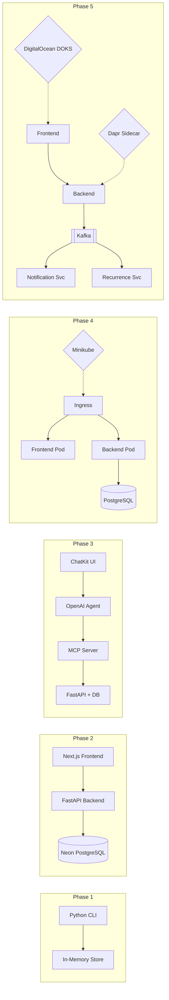

# Hackathon II: Spec-Driven Todo App

A progressive todo application built across 5 phases — evolving from a Python console app to a cloud-deployed, AI-powered, event-driven system on Kubernetes.

## Phases

| Phase | Description | Stack | Points | Due |
|-------|-------------|-------|--------|-----|
| **1** | In-Memory Console App | Python, CLI | 100 | Dec 7, 2025 |
| **2** | Full-Stack Web App | Next.js, FastAPI, SQLModel, Neon DB | 150 | Dec 14, 2025 |
| **3** | AI-Powered Chatbot | OpenAI ChatKit, Agents SDK, MCP SDK | 200 | Dec 21, 2025 |
| **4** | Local K8s Deployment | Docker, Minikube, Helm, kubectl-ai | 250 | Jan 4, 2026 |
| **5** | Cloud Deployment | Kafka, Dapr, DigitalOcean DOKS | 300 | Jan 18, 2026 |

**Total Points:** 1000

## Architecture Evolution



## Feature Set

Every phase implements the full feature set progressively:

**Basic** — CRUD operations: add, view, update, delete, and mark tasks complete.

**Intermediate** — Priorities (high/medium/low), tags/categories, keyword search, filtering by status/priority/tag/date, and multi-field sorting.

**Advanced** — Recurring tasks with auto-rescheduling (daily, weekly, monthly), due dates with time pickers, and browser notification reminders.

## Repository Structure

```
hackathon-todo/
├── claude.md              # AI coding assistant instructions
├── README.md              # This file
├── .gitignore
├── phase-1-console/       # Python CLI app
├── phase-2-fullstack/     # Next.js + FastAPI + Neon DB
├── phase-3-ai-chatbot/    # OpenAI Agent + MCP + ChatKit
├── phase-4-k8s-local/     # Docker + Minikube + Helm
└── phase-5-cloud/         # Kafka + Dapr + DigitalOcean DOKS
```

Each phase is **fully independent** — no shared code between phases. Navigate to any phase directory and follow its own README for setup and usage.

## Quick Start

### Phase 1 — Console App

```bash
cd phase-1-console
python -m venv .venv
source .venv/bin/activate
pip install -r requirements.txt
python src/main.py
```

### Phase 2 — Full-Stack Web App

```bash
# Backend
cd phase-2-fullstack/backend
python -m venv .venv
source .venv/bin/activate
pip install -r requirements.txt
cp .env.example .env          # Add your Neon DB URL
alembic upgrade head
uvicorn app.main:app --reload

# Frontend (separate terminal)
cd phase-2-fullstack/frontend
npm install
cp .env.example .env.local    # Set API URL
npm run dev
```

### Phase 3 — AI Chatbot

```bash
# Backend (same as Phase 2 + OpenAI config)
cd phase-3-ai-chatbot/backend
pip install -r requirements.txt
cp .env.example .env          # Add OpenAI API key + DB URL
uvicorn app.main:app --reload

# Frontend
cd phase-3-ai-chatbot/frontend
npm install
npm run dev
```

### Phase 4 — Local Kubernetes

```bash
cd phase-4-k8s-local

# Start Minikube
./scripts/setup-minikube.sh

# Build & Deploy
./scripts/deploy.sh

# Access
echo "$(minikube ip) todo.local" | sudo tee -a /etc/hosts
open http://todo.local
```

### Phase 5 — Cloud Deployment

```bash
cd phase-5-cloud

# Provision DigitalOcean cluster
doctl kubernetes cluster create todo-cluster --region nyc1 --size s-2vcpu-4gb --count 2

# Install Dapr
dapr init -k

# Deploy
./scripts/deploy-doks.sh
```

## Task Data Model

Consistent across all phases:

| Field | Type | Description |
|-------|------|-------------|
| `id` | UUID | Unique identifier |
| `title` | string | Task title (required, max 200 chars) |
| `description` | string | Optional details (max 2000 chars) |
| `status` | enum | `pending` · `in_progress` · `completed` |
| `priority` | enum | `low` · `medium` · `high` |
| `tags` | string[] | Free-form labels (e.g., work, home) |
| `due_date` | datetime | Optional deadline |
| `reminder_at` | datetime | Optional notification time |
| `is_recurring` | boolean | Whether task repeats |
| `recurrence_rule` | string | Frequency: daily, weekly, monthly, yearly |
| `next_occurrence` | datetime | Auto-calculated next due date |
| `created_at` | datetime | Auto-set on creation |
| `updated_at` | datetime | Auto-set on modification |
| `completed_at` | datetime | Set when marked complete |

## API Endpoints (Phase 2+)

```
POST   /api/tasks              Create a task
GET    /api/tasks              List tasks (filter, sort, search via query params)
GET    /api/tasks/{id}         Get task by ID
PATCH  /api/tasks/{id}         Update task fields
DELETE /api/tasks/{id}         Delete a task
POST   /api/tasks/{id}/complete Toggle completion status
GET    /health                  Health check
```

**Query Parameters:**
`?status=pending&priority=high&search=meeting&tag=work&sort_by=due_date&sort_order=asc`

## Tech Stack Summary

| Layer | Technology |
|-------|-----------|
| Console UI | Python CLI (input/print) |
| Web Frontend | Next.js 14+, Tailwind CSS, TypeScript |
| Chat Frontend | OpenAI ChatKit |
| Backend API | FastAPI, SQLModel, Pydantic |
| Database | Neon DB (Serverless PostgreSQL) |
| AI Layer | OpenAI Agents SDK, MCP SDK |
| Containerization | Docker, multi-stage builds |
| Orchestration | Minikube (local), DigitalOcean DOKS (cloud) |
| Packaging | Helm charts |
| Messaging | Apache Kafka |
| Microservice Runtime | Dapr |

## License

Private — Hackathon project.
