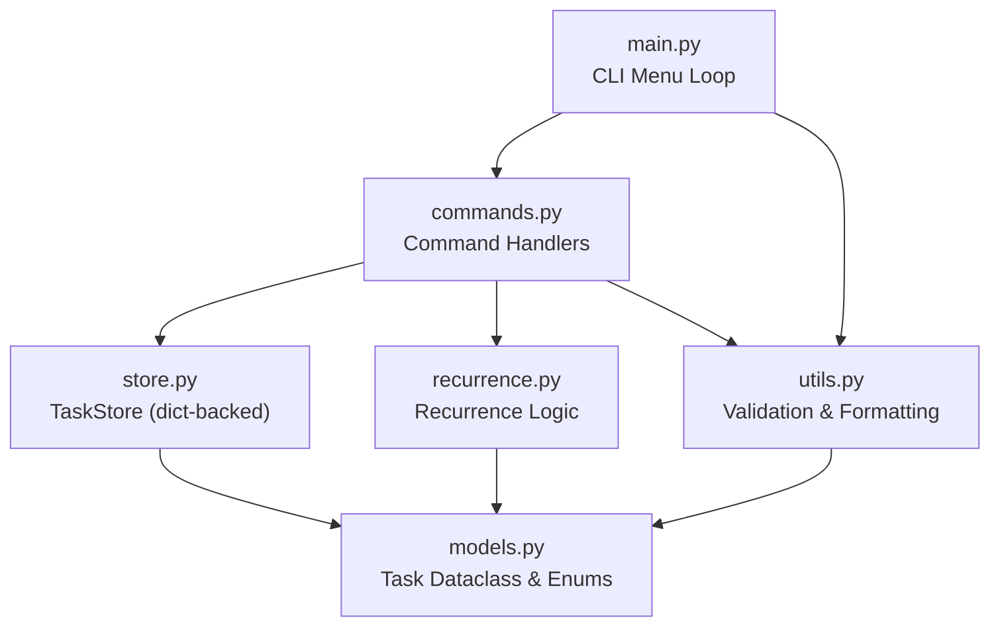

# Phase 1: In-Memory Console Todo App

A Python console application for managing todo tasks entirely in memory. Built as Phase 1 of the Hackathon II spec-driven project, this app provides a menu-driven CLI interface with full CRUD operations, search, filtering, sorting, and recurring task management. All data is stored in-memory and is lost when the application exits.

---

## Features

### Basic (Core CRUD)
- Add tasks with title, description, priority, and tags
- View all tasks in a summary list
- View full details of a single task
- Update any task field (partial updates supported)
- Delete tasks by ID (with confirmation prompt)
- Toggle task completion status (pending/completed)

### Intermediate (Organization and Usability)
- Assign priority levels: `low`, `medium`, `high`
- Assign free-form tags/categories (comma-separated)
- Search tasks by keyword across titles and descriptions (case-insensitive)
- Filter tasks by status, priority, tag, and date range (`due_before` / `due_after`)
- Sort tasks by title, priority, due date, or creation date (ascending/descending)
- Combined filter and sort operations

### Advanced (Intelligent Features)
- Recurring tasks with rules: `daily`, `weekly`, `monthly`, `yearly`
- Auto-creation of the next occurrence when a recurring task is completed
- Due dates with datetime support (`YYYY-MM-DD` or `YYYY-MM-DD HH:MM`)
- Reminder timestamps for future notifications
- Overdue task detection and tracking via `completed_at` timestamps

---

## Architecture



**Module responsibilities:**

| Module | Purpose |
|---|---|
| `main.py` | Entry point. Renders the CLI menu, collects user input, and dispatches to command handlers. |
| `commands.py` | Business logic for all operations: add, view, update, delete, toggle, search, filter, sort. |
| `store.py` | In-memory `TaskStore` backed by a Python dictionary. Provides CRUD primitives (`add`, `get`, `get_all`, `update`, `delete`, `count`). |
| `models.py` | `Task` dataclass with UUID generation and auto-timestamps. Defines `Status`, `Priority`, and `RecurrenceRule` enums. |
| `recurrence.py` | Calculates the next occurrence date for recurring tasks and creates clones with updated due dates. |
| `utils.py` | Input validation (title length, enum values), date parsing, tag parsing, and task formatting for display. |

---

## File Structure

```
phase-1-console/
├── README.md                          # This file
├── requirements.txt                   # Python dependencies (pytest, python-dateutil)
├── src/
│   ├── __init__.py
│   ├── main.py                        # Entry point -- CLI menu loop
│   ├── models.py                      # Task dataclass, Status/Priority/RecurrenceRule enums
│   ├── store.py                       # In-memory TaskStore (dict-backed CRUD)
│   ├── commands.py                    # Command handlers for all operations
│   ├── recurrence.py                  # Recurring task calculation and cloning
│   └── utils.py                       # Input validation, formatting, date parsing
└── tests/
    ├── __init__.py
    ├── test_models.py                 # Task model creation, enums, UUID uniqueness
    ├── test_store.py                  # TaskStore CRUD operations
    ├── test_utils.py                  # Validators, parsers, formatters
    ├── test_commands.py               # Add, delete, update, view, toggle commands
    ├── test_search_filter_sort.py     # Search, filter, and sort operations
    ├── test_recurrence.py             # Next occurrence calculation, clone creation
    └── test_recurrence_toggle.py      # Recurring task auto-creation on toggle
```

---

## Setup Instructions

**Prerequisites:** Python 3.12+

```bash
# Navigate to the project directory
cd phase-1-console

# Create and activate a virtual environment
python -m venv .venv

.\.venv\Scripts\activate         # Windows (cmd)

# Install dependencies
pip install -r requirements.txt
```

### Run the Application

```bash
python -m src.main
```

---

## Usage Examples

Below is a sample CLI session demonstrating the core workflows.

### Adding a Task

```
=== Todo App ===
1.  Add Task
...
Choose an option (1-10): 1

  Title (required): Review pull requests
  Description (optional, press Enter to skip): Check open PRs on the main repo
  Priority (low/medium/high, default: medium): high
  Tags (comma-separated, optional): work, code-review
  Due date (YYYY-MM-DD or YYYY-MM-DD HH:MM, optional): 2025-12-10
  Reminder (YYYY-MM-DD HH:MM, optional):
  Recurring? (yes/no, default: no): no

  Task added: Review pull requests (ID: 3a7f2c1e)
```

### Viewing All Tasks

```
Choose an option (1-10): 2

  --- All Tasks (3) ---
  [3a7f2c1e] Review pull requests      | HIGH    | pending    | Due: 2025-12-10
  [b1c9d4f0] Buy groceries             | medium  | pending    | Due: 2025-12-08
  [e5a2f8b3] Morning standup           | low     | completed  | Due: 2025-12-07
```

### Searching by Keyword

```
Choose an option (1-10): 7

  Search keyword: review

  --- Search Results (1) ---
  [3a7f2c1e] Review pull requests      | HIGH    | pending    | Due: 2025-12-10
```

### Filtering Tasks

```
Choose an option (1-10): 8

  (Press Enter to skip a filter)
  Status (pending/in_progress/completed): pending
  Priority (low/medium/high): high
  Tag:
  Due before (YYYY-MM-DD):
  Due after (YYYY-MM-DD):

  --- Filtered Results (1) ---
  [3a7f2c1e] Review pull requests      | HIGH    | pending    | Due: 2025-12-10
```

### Sorting Tasks

```
Choose an option (1-10): 9

  Sort by (title/priority/due_date/created_at): priority
  Order (asc/desc, default: asc): desc

  --- Sorted by priority (desc) ---
  [3a7f2c1e] Review pull requests      | HIGH    | pending    | Due: 2025-12-10
  [b1c9d4f0] Buy groceries             | medium  | pending    | Due: 2025-12-08
  [e5a2f8b3] Morning standup           | low     | completed  | Due: 2025-12-07
```

### Toggle Completion (with Recurring Task)

```
Choose an option (1-10): 6

  Task ID to toggle: b1c9d4f0

  'Buy groceries' -> completed
  Next recurring instance created automatically.
```

When a recurring task is marked complete, the app automatically creates a new pending task with the next due date calculated from the recurrence rule.

---

## Testing

The project includes a comprehensive test suite with **75 tests** covering all functionality.

### Run All Tests

```bash
# With verbose output
python -m pytest tests/ -v

# Short summary
python -m pytest tests/ --tb=short
```

### Test Coverage Breakdown

| Test File | Tests | Covers |
|---|---|---|
| `test_models.py` | 6 | Task creation, defaults, UUID uniqueness, enum values |
| `test_store.py` | 9 | TaskStore add, get, get_all, delete, update, count |
| `test_utils.py` | 14 | Title validation, priority/status validation, date parsing, tag parsing, formatters |
| `test_commands.py` | 15 | Add, delete, update, view all, view detail, toggle complete |
| `test_search_filter_sort.py` | 15 | Keyword search, filter by status/priority/tag/combined, sort by title/priority/date |
| `test_recurrence.py` | 10 | Daily/weekly/monthly/yearly calculation, end-of-month handling, clone creation |
| `test_recurrence_toggle.py` | 6 | Auto-clone on toggle, non-recurring no-op, uncomplete no-op |

### Expected Output

```
============================= 75 passed in 0.09s ==============================
```

---

## Data Model

Each task is represented by a Python dataclass with the following fields:

| Field | Type | Description |
|---|---|---|
| `id` | `str` (UUID) | Unique identifier, auto-generated |
| `title` | `str` | Required, max 200 characters |
| `description` | `str` | Optional, max 2000 characters |
| `status` | `Status` enum | `pending`, `in_progress`, or `completed` |
| `priority` | `Priority` enum | `low`, `medium`, or `high` |
| `tags` | `list[str]` | Free-form labels (e.g., `["work", "urgent"]`) |
| `due_date` | `datetime` or `None` | Optional deadline |
| `reminder_at` | `datetime` or `None` | Optional reminder timestamp |
| `is_recurring` | `bool` | Whether the task repeats |
| `recurrence_rule` | `RecurrenceRule` or `None` | `daily`, `weekly`, `monthly`, or `yearly` |
| `next_occurrence` | `datetime` or `None` | Auto-calculated next due date for recurring tasks |
| `created_at` | `datetime` | Auto-set on creation |
| `updated_at` | `datetime` | Auto-set on creation and modification |
| `completed_at` | `datetime` or `None` | Set when status changes to `completed` |

---

## Tech Stack

| Component | Technology |
|---|---|
| Language | Python 3.12+ |
| Testing | pytest >= 7.4 |
| Date handling | python-dateutil >= 2.8 |
| Storage | In-memory Python dictionary |
| Task IDs | UUID4 |

---

## Limitations

- **In-memory only:** All tasks are lost when the application exits. There is no file-based or database persistence.
- **No concurrency:** Single-threaded, single-user CLI application.
- **No reminders at runtime:** Reminder timestamps are stored but not actively triggered (no background scheduler).
- **No undo/redo:** Deletions and completions are immediate and cannot be reversed.
- **Terminal-dependent:** Requires an interactive terminal for the menu-driven interface.
