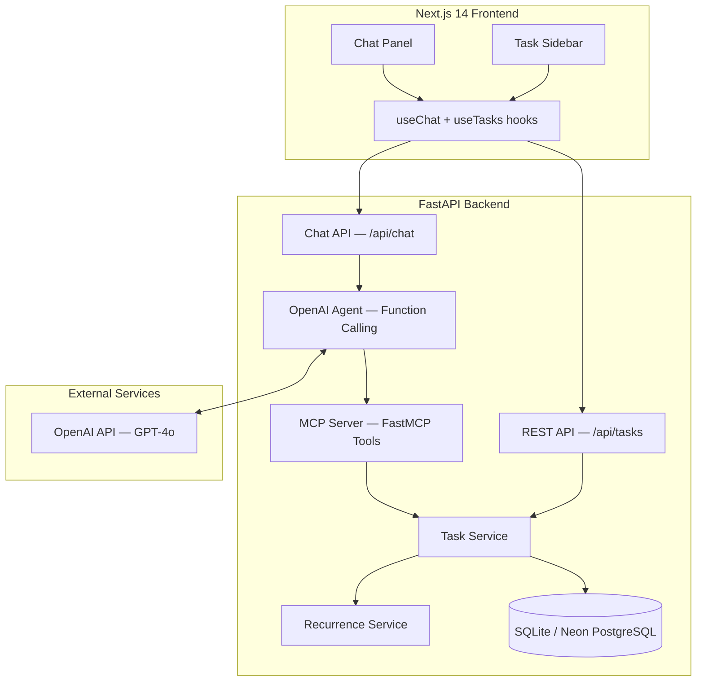

# Phase 3 — AI-Powered Todo Chatbot

An AI-powered todo application that extends Phase 2's full-stack architecture with OpenAI function calling and MCP (Model Context Protocol) tools, enabling natural language task management through a conversational chat interface.

## Overview

Phase 3 adds an AI agent layer on top of the existing FastAPI + Next.js stack. Users interact with their todo list through natural language commands processed by an OpenAI agent that uses MCP tools to perform CRUD operations on the database. The frontend provides a split-pane layout with a chat panel and a live task sidebar.

## Architecture



**Data flow for a chat message:**
1. User types a natural language command in the Chat Panel
2. `useChat` hook sends it to `POST /api/chat`
3. Chat router calls `run_agent()` with the message and conversation history
4. Agent sends the message to OpenAI with tool definitions
5. OpenAI returns tool calls (e.g., `create_task`, `list_tasks`)
6. Agent executes tool calls via MCP server functions against the database
7. Agent loops back to OpenAI with tool results until a final response is generated
8. Response is returned to the frontend; task sidebar auto-refreshes via polling

## Backend Setup

```bash
cd phase-3-ai-chatbot/backend

# Create virtual environment
python -m venv .venv
# source .venv/bin/activate    # Linux/macOS
.\.venv\Scripts\activate     # Windows

# Install dependencies
pip install -r requirements.txt

# Configure environment
copy .env.example .env
# Edit .env with your DATABASE_URL, OPENAI_API_KEY, etc.

# Run database migrations
alembic upgrade head

# Start the server
uvicorn app.main:app --reload --port 8000
```

API documentation is auto-generated at:
- Swagger UI: http://localhost:8000/docs
- ReDoc: http://localhost:8000/redoc

## Frontend Setup

```bash
cd phase-3-ai-chatbot/frontend

# Install dependencies
npm install

# Configure environment
copy .env.example .env.local
# Edit .env.local: NEXT_PUBLIC_API_URL=http://localhost:8000

# Start development server
npm run dev
```

The frontend runs at http://localhost:3000.

## UI Layout

```
+---------------------------------------------+
|           Todo AI Assistant                  |
+------------------------+--------------------+
|                        |                    |
|    Chat Panel          |   Task Sidebar     |
|    (2/3 width)         |   (1/3 width)      |
|                        |                    |
|  [message bubbles...]  |  [task cards...]   |
|                        |                    |
|  [input + send btn]    |                    |
+------------------------+--------------------+
```

- **Chat Panel:** User (blue, right-aligned) and assistant (gray, left-aligned) message bubbles with timestamps. Enter to send, Shift+Enter for newlines.
- **Task Sidebar:** Live task cards with priority badges, due dates, overdue highlighting, tags, and recurrence indicators. Auto-refreshes every 5 seconds.

## AI Agent

The AI agent uses the standard OpenAI `chat.completions` API with **function calling** (not the Agents SDK). It is defined in `backend/app/agents/todo_agent.py`.

The agent understands natural language commands such as:

- "Add a high priority task to review PRs by Friday"
- "Show me all overdue tasks"
- "Mark the grocery task as done"
- "Create a recurring daily task to check emails"
- "What tasks are due this week?"
- "Delete all completed tasks"

The agent supports **multi-turn tool calling** — a single user message can trigger multiple tool calls (e.g., "create three tasks") in a loop of up to 10 iterations.

## MCP Tools

The MCP server (`backend/app/mcp/server.py`) uses FastMCP to expose tools to the AI agent. Each tool has both a plain testable function (accepts a `Session`) and a `@mcp_server.tool()` decorated async version.

| Tool | Description | Required Params |
|------|-------------|-----------------|
| `create_task` | Create a new task | `title` |
| `list_tasks` | List/filter/sort tasks | none |
| `get_task` | Get task details by ID | `task_id` |
| `update_task` | Partially update a task | `task_id` |
| `delete_task` | Delete a task | `task_id` |
| `complete_task` | Toggle completion (handles recurrence) | `task_id` |

## API Endpoints

### Task CRUD
| Method | Endpoint | Description |
|--------|----------|-------------|
| POST | `/api/tasks` | Create a task (201) |
| GET | `/api/tasks` | List tasks (query params: status, priority, search, tag, sort_by, sort_order) |
| GET | `/api/tasks/{id}` | Get a single task |
| PATCH | `/api/tasks/{id}` | Partial update |
| DELETE | `/api/tasks/{id}` | Delete a task (204) |
| POST | `/api/tasks/{id}/complete` | Toggle completion |

### Chat
| Method | Endpoint | Description |
|--------|----------|-------------|
| POST | `/api/chat` | Send a message to the AI agent. Body: `{message, history}` |

### Health
| Method | Endpoint | Description |
|--------|----------|-------------|
| GET | `/health` | Health check |

## Testing

```bash
cd phase-3-ai-chatbot/backend
python -m pytest tests/ -v
```

### Test Coverage (53 tests)

| Test File | Tests | What |
|-----------|-------|------|
| `test_tasks_api.py` | 20 | REST API endpoint tests (CRUD, filter, toggle) |
| `test_mcp_tools.py` | 25 | MCP tool function tests (create, list, get, update, delete, complete, recurrence) |
| `test_agent.py` | 8 | Agent config (system prompt, tool definitions, tool execution) |

## Environment Variables

### Backend (`backend/.env`)
| Variable | Description | Default |
|----------|-------------|---------|
| `DATABASE_URL` | Database connection string | `sqlite:///./todo.db` |
| `CORS_ORIGINS` | Comma-separated allowed origins | `http://localhost:3000` |
| `OPENAI_API_KEY` | OpenAI API key for the agent | (required for chat) |

### Frontend (`frontend/.env.local`)
| Variable | Description | Default |
|----------|-------------|---------|
| `NEXT_PUBLIC_API_URL` | Backend API base URL | `http://localhost:8000` |

## Project Structure

```
phase-3-ai-chatbot/
+-- backend/
|   +-- app/
|   |   +-- agents/
|   |   |   +-- todo_agent.py      # OpenAI agent with function calling
|   |   +-- mcp/
|   |   |   +-- server.py          # MCP tools (FastMCP + plain functions)
|   |   +-- routers/
|   |   |   +-- tasks.py           # Task CRUD endpoints
|   |   |   +-- chat.py            # Chat endpoint
|   |   +-- services/
|   |   |   +-- task_service.py    # Business logic
|   |   |   +-- recurrence_service.py
|   |   +-- config.py, db.py, models.py, schemas.py, main.py
|   +-- tests/
|   |   +-- test_tasks_api.py, test_mcp_tools.py, test_agent.py
|   +-- requirements.txt
+-- frontend/
|   +-- src/
|   |   +-- app/
|   |   |   +-- page.tsx           # Split-pane layout
|   |   |   +-- layout.tsx
|   |   +-- components/
|   |   |   +-- ChatPanel.tsx      # Chat message list + input
|   |   |   +-- ChatMessage.tsx    # Message bubble
|   |   |   +-- ChatInput.tsx      # Input with send button
|   |   |   +-- TaskSidebar.tsx    # Live task list
|   |   |   +-- TaskCard.tsx       # Compact task card
|   |   +-- hooks/
|   |   |   +-- useChat.ts         # Chat state management
|   |   |   +-- useTasks.ts        # Task polling
|   |   +-- lib/api.ts             # API client
|   |   +-- types/
|   |       +-- task.ts, chat.ts
|   +-- package.json
+-- README.md
```
