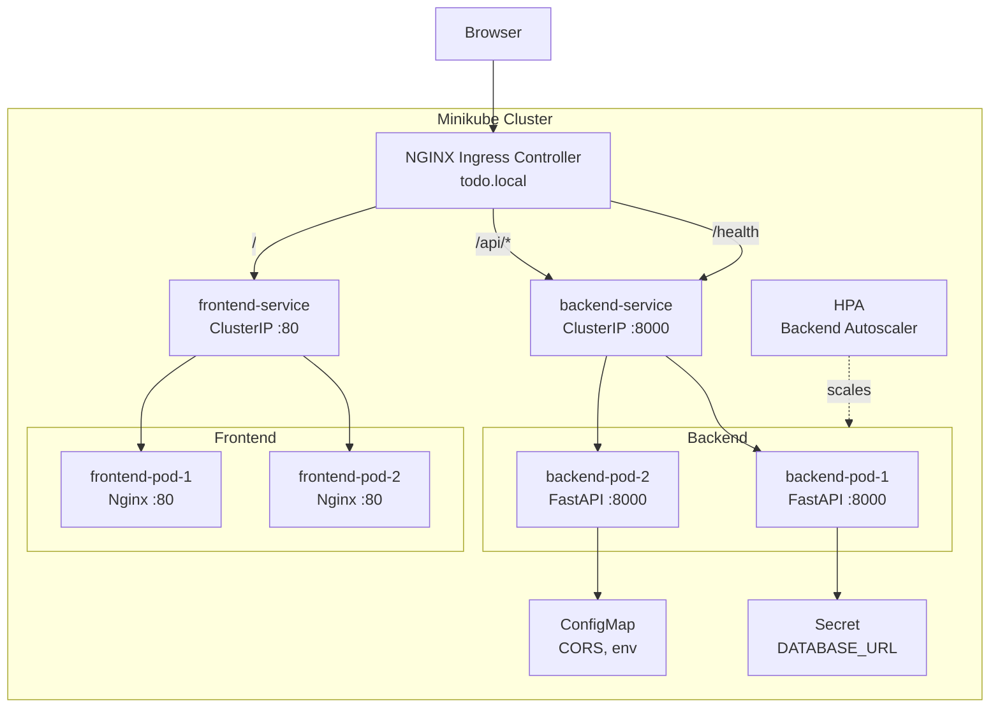

# Phase 4 — Local Kubernetes Deployment

Dockerized and Kubernetes-orchestrated deployment of the Todo App using Minikube and Helm.

## Overview

This phase containerizes the Phase 2 full-stack application (FastAPI backend + Next.js frontend) and deploys it to a local Kubernetes cluster using Minikube and Helm charts. Features include multi-stage Docker builds, Helm chart templating, NGINX ingress, horizontal pod autoscaling, and automated deploy scripts.

## Architecture



## Prerequisites

- Docker Desktop or Docker Engine
- Minikube v1.32+
- kubectl v1.28+
- Helm v3.13+
- Node.js 20+ (for frontend build)
- Python 3.12+ (for backend)

## Quick Start

```bash
# 1. Setup Minikube
chmod +x scripts/*.sh
./scripts/setup-minikube.sh

# 2. Build and deploy
./scripts/deploy.sh

# 3. Add to /etc/hosts
echo "$(minikube ip) todo.local" | sudo tee -a /etc/hosts

# 4. Open http://todo.local
```

## Docker Setup (Local Development)

Build and run all services with Docker Compose:

```bash
cd docker
docker compose up --build
```

Services:
- Frontend: http://localhost:3000
- Backend API: http://localhost:8000
- Swagger docs: http://localhost:8000/docs
- PostgreSQL: localhost:5432

The compose file includes health checks for both backend (Python urllib) and PostgreSQL (pg_isready), with proper startup ordering.

## Minikube Setup

```bash
./scripts/setup-minikube.sh
```

This script:
1. Starts Minikube with Docker driver (2 CPUs, 4GB RAM)
2. Enables addons: ingress, metrics-server, dashboard
3. Waits for the ingress controller to be ready
4. Displays the Minikube IP for /etc/hosts configuration

## Helm Deployment

### One-step deploy

```bash
./scripts/deploy.sh
```

This script builds Docker images inside Minikube's Docker daemon and deploys with Helm.

### Manual deployment

```bash
# Point Docker to Minikube
eval $(minikube docker-env)

# Build images
docker build -t todo-backend:latest -f docker/Dockerfile.backend backend/
docker build -t todo-frontend:latest -f docker/Dockerfile.frontend frontend/

# Deploy
helm upgrade --install todo-app k8s/helm/todo-app/ --wait --timeout 180s

# Verify
kubectl get pods -l "app.kubernetes.io/name=todo-app"
kubectl get ingress
```

### Access the app

```bash
# Add to hosts file
echo "$(minikube ip) todo.local" | sudo tee -a /etc/hosts
# Windows: add to C:\Windows\System32\drivers\etc\hosts

# Open in browser
open http://todo.local
```

### Upgrade / Uninstall

```bash
helm upgrade todo-app k8s/helm/todo-app/
helm uninstall todo-app
```

## Helm Values Reference

| Key | Default | Description |
|-----|---------|-------------|
| `backend.image.repository` | `todo-backend` | Backend image name |
| `backend.image.tag` | `latest` | Backend image tag |
| `backend.replicas` | `2` | Backend pod count |
| `backend.port` | `8000` | Backend container port |
| `backend.resources.requests.cpu` | `100m` | CPU request |
| `backend.resources.limits.cpu` | `500m` | CPU limit |
| `backend.resources.limits.memory` | `512Mi` | Memory limit |
| `frontend.image.repository` | `todo-frontend` | Frontend image name |
| `frontend.replicas` | `2` | Frontend pod count |
| `frontend.port` | `80` | Frontend container port (nginx) |
| `ingress.enabled` | `true` | Enable NGINX ingress |
| `ingress.host` | `todo.local` | Ingress hostname |
| `hpa.enabled` | `true` | Enable horizontal pod autoscaler |
| `hpa.minReplicas` | `2` | Min backend replicas |
| `hpa.maxReplicas` | `5` | Max backend replicas |
| `hpa.targetCPUUtilizationPercentage` | `70` | CPU threshold for scaling |

## K8s Resources Created

| Resource | Name | Purpose |
|----------|------|---------|
| Deployment | `*-backend` | FastAPI backend (2 replicas) |
| Deployment | `*-frontend` | Nginx frontend (2 replicas) |
| Service | `*-backend` | ClusterIP for backend |
| Service | `*-frontend` | ClusterIP for frontend |
| ConfigMap | `*-config` | App env, log level, CORS |
| Secret | `*-secret` | Database URL (base64) |
| Ingress | `*-ingress` | Routes /api to backend, / to frontend |
| HPA | `*-backend-hpa` | Auto-scales backend on CPU |

## Testing

### Backend tests

```bash
cd backend
python -m venv .venv
#source .venv/bin/activate  # Linux/macOS
.venv\Scripts\activate   # Windows
pip install -r requirements.txt
python -m pytest tests/ -v
```

23 tests covering: health check, CRUD operations, filtering, search, sorting, toggle complete, recurring task auto-creation.

### Frontend build

```bash
cd frontend
npm install
npm run build
```

Builds as static export (output: "export") served by nginx.

## kubectl-ai

Use kubectl-ai for natural language Kubernetes operations:

```bash
kubectl krew install ai
kubectl ai "show me all pods for todo-app"
kubectl ai "scale the backend deployment to 3 replicas"
kubectl ai "show logs for the backend pod"
```

## kagent

Use kagent for AI-powered cluster management:

```bash
# See: https://github.com/kagent-dev/kagent
kagent "check the health of my todo-app deployment"
kagent "why is the backend pod crashing?"
```

## Troubleshooting

### Pods stuck in ImagePullBackOff
```bash
# Ensure images are built in Minikube's Docker daemon
eval $(minikube docker-env)
docker images | grep todo
```

### Ingress not working
```bash
kubectl get pods -n ingress-nginx
minikube addons enable ingress
```

### Backend cannot connect to database
```bash
kubectl get secrets
kubectl logs -l app.kubernetes.io/component=backend --tail=50
```

### Port-forwarding for debugging
```bash
kubectl port-forward svc/todo-app-backend 8000:8000
kubectl port-forward svc/todo-app-frontend 3000:80
```

### View dashboard
```bash
minikube dashboard
```

## Project Structure

```
phase-4-k8s-local/
+-- backend/                    # FastAPI application
|   +-- app/
|   |   +-- main.py             # App entry with health check
|   |   +-- config.py, db.py, models.py, schemas.py
|   |   +-- routers/tasks.py    # REST API
|   |   +-- services/           # Business logic
|   +-- tests/test_tasks_api.py # 23 tests
|   +-- requirements.txt
+-- frontend/                   # Next.js static export
|   +-- src/
|   |   +-- app/                # Pages and layout
|   |   +-- components/         # UI components
|   |   +-- hooks/              # Data fetching hooks
|   |   +-- lib/api.ts          # API client
|   |   +-- types/              # TypeScript interfaces
|   +-- next.config.js          # output: "export"
+-- docker/
|   +-- Dockerfile.backend      # Python multi-stage (slim)
|   +-- Dockerfile.frontend     # Node build + nginx serve
|   +-- docker-compose.yml      # Local dev (app + postgres)
|   +-- nginx.conf              # Nginx config with API proxy
+-- k8s/
|   +-- helm/todo-app/
|   |   +-- Chart.yaml
|   |   +-- values.yaml
|   |   +-- templates/          # 8 template files
|   +-- manifests/
|       +-- namespace.yaml
+-- scripts/
|   +-- setup-minikube.sh       # Cluster setup
|   +-- deploy.sh               # Build + Helm deploy
+-- README.md
```
